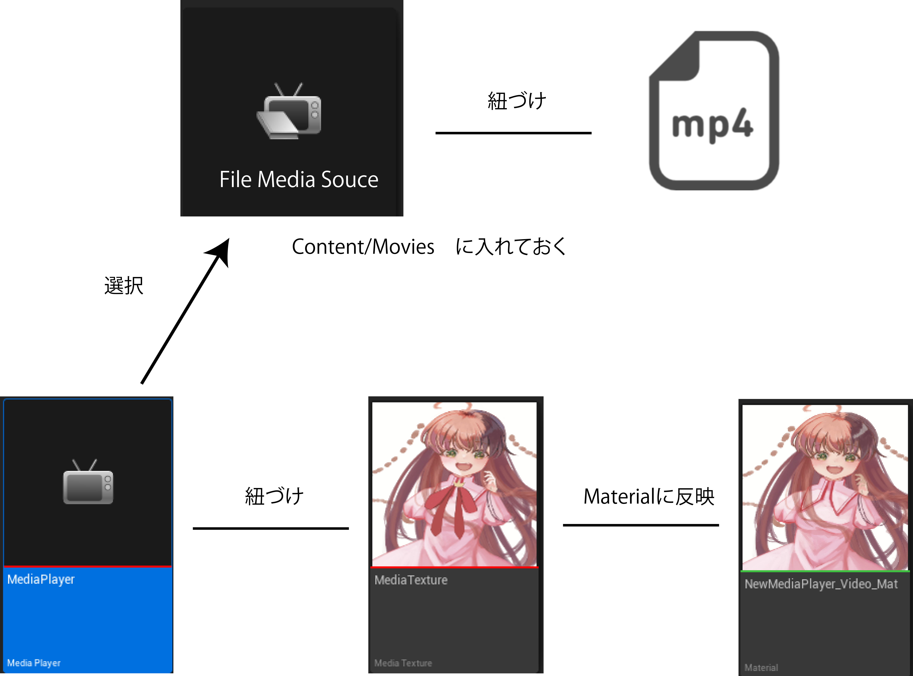
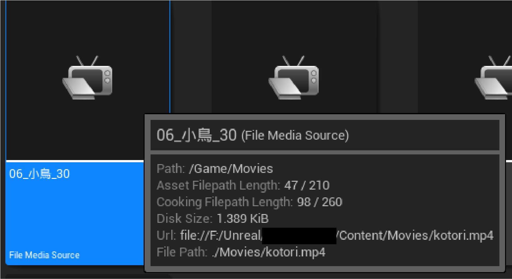
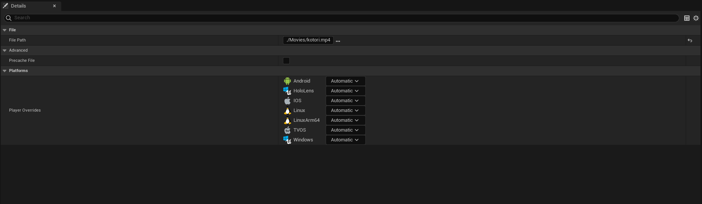
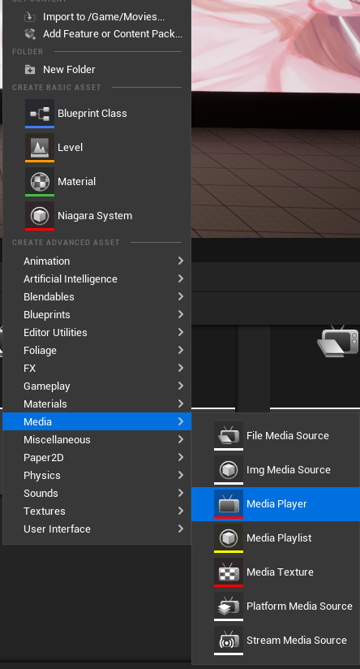
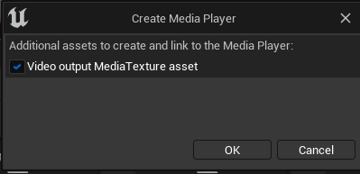
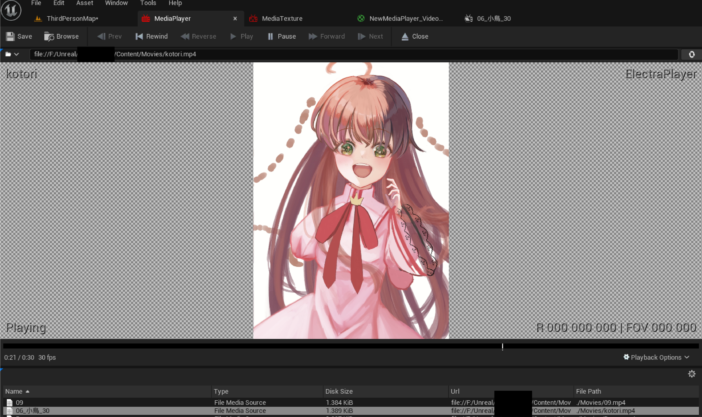
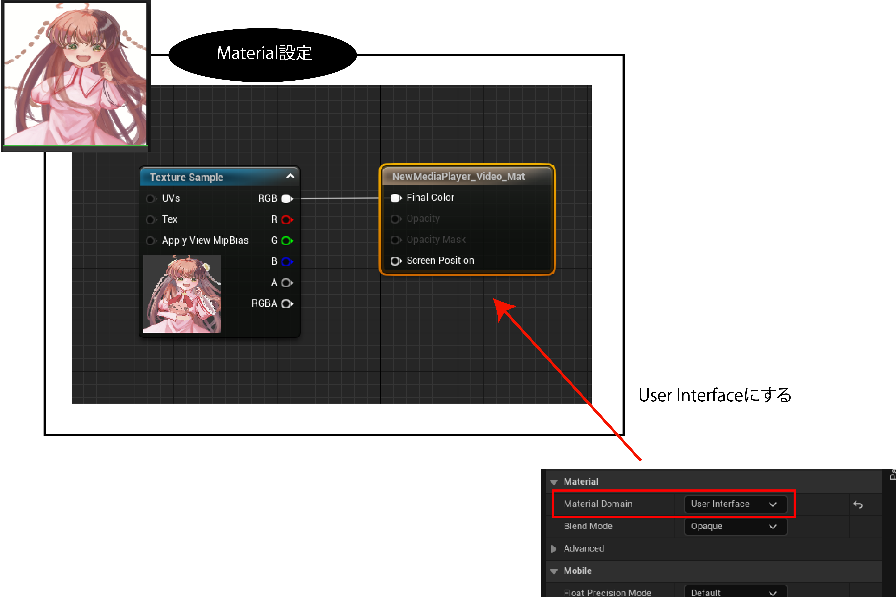
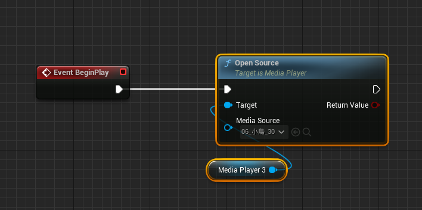

+++
draft = false
thumbnail = "2022/07/Handling-Video-Playback-Issues-in-UE5/thumbnail.png"
tags = ["UE5"]
categories = "UE5"
date = "2022-07-01T14:15:25+09:00"
title = "UE5でビデオ再生がうまくいかないときの対処法"
description = "UE5でビデオ再生が上手くいかない場合の対処法まとめ"
toc = true
archives = ["2022/7"]
+++

## 公式の手順を試しても真っ白のまま
https://docs.unrealengine.com/5.0/ja/play-a-video-file-in-unreal-engine/

上記の手順をとりあえずそのまま試してみたのですが、Planeに貼り付けたマテリアルは真っ白のまま...そもそもmp4が再生できていない感じがする。  

## Electra Playerを使うと良い
結論から言うと、WMFではなくElectra Playerを使うと解決しました。  
フォーラムを見てみると、UE5のバージョンが問題だったり、DXI1じゃないとだめだとか色々書いてありましたが、ElectraPlayerを使ったら解決しました。  
https://forums.unrealengine.com/t/error-with-video-input-to-media-player-ue5/508033

ElectraPlayerはプラグインを有効にすると使えます。  
  

## 概要図
UE5で動画再生は下記のようなイメージです。  
Materialとしてmp4を反映したら、Planeでもなんでも好きなものに設定すればOKです。  
  

### FileSourceMediaとmp4ファイルを紐づけする
mp4ファイルをUEで使えるように、content/Moviesに入れておきます。  
これでおそらく起動時やインポート時に勝手にmp4.uassetみたいな感じで作成されているはず。  
このuassetsがFileMediaSourceクラスとしてエディター側で確認できます。  

  

FileMediaSourceを確認するとUrlにmp4本体が紐づけされているのがわかると思いますが、FileMediaSourceを開いて指定することが出来ます。  
このとき、指定するmp4は英文字でなければ再生出来ないので注意。  

  

### MediaPlayerとMediaTextureを作成する
ContentBrowserで右クリックすると作成できる。  
作成時にポップアップが表示されるので、チェックマークをつければMediaTextureも紐づけされた状態で作成されるのでチェックしましょう。  

   

MediaPlayerを開くとFileMediaSourceを認識してくれていて、選択すると再生できるはず。  
右上にもElectraPlayerと表示されていますね。  
  

一応MediaTexture側も開いて、Details欄のMediaPlayer欄が正しく設定されているかどうかも確認してください。  

### Materialとして使えるようにする
次に、MediaTextureをMaterialに変換して、自由に使えるようにします。  
Materialを作成したら、MaterialDomainを「User Interface」にします。  
その後、生成されるFinal Colorに接続されたノードで、先程設定したMediaTextureを指定します。  
  

### LevelBPなどで再生するように設定する
後は実際にレベル上で再生されるようにBPを組むだけです。  
レベルにPlaneなど配置して、そこに先程作成したmaterialを紐づければ再生されるようになります。
  

  

## まとめ
UE5でレベル内で動画を再生する方法についてまとめてみました。  
VR展示会を作るとか、ゲームのカットインみたいな感じで使えるのかな？という感じがしています。  