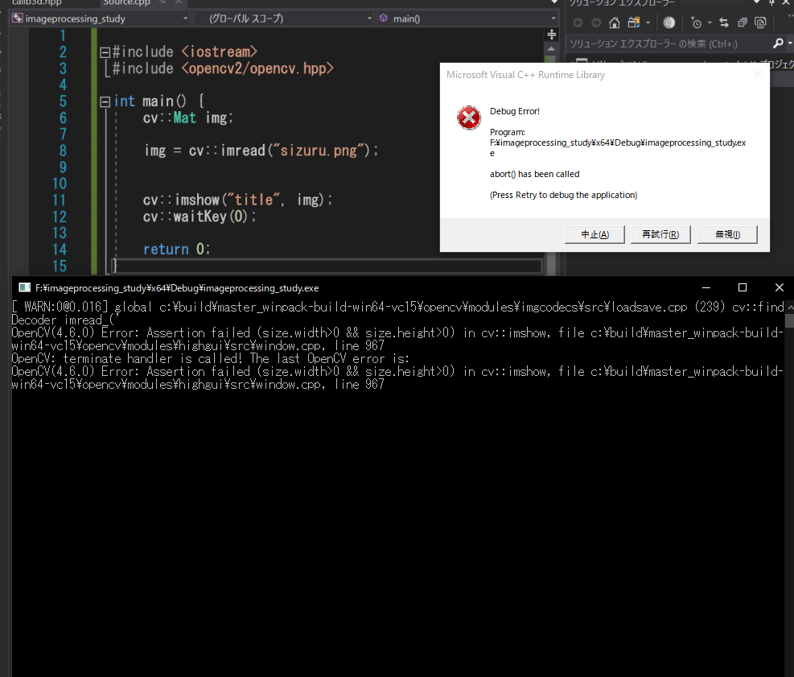
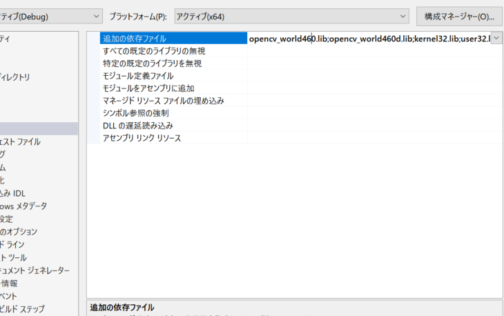
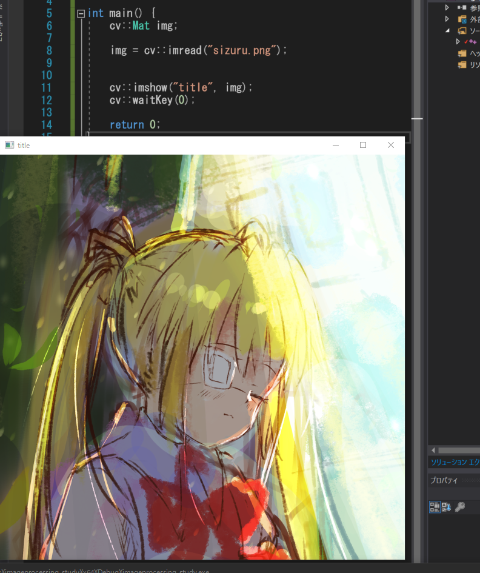

+++
draft = false
thumbnail = "2022/07/Solving-Image-Loading-Issue-in-OpenCV-Cpp/thumbnail.png"
tags = ["C/C++","VisualStudio","OpenCV"]
categories = "C/C++"
date = "2022-07-24T17:26:49+09:00"
title = "OpenCV(C++)で画像が読み込めない問題を解消する"
description = "OpenCVで画像が読み込めない問題を解消する。"
toc = true
archives = ["2022/7"]
+++

C++勉強しつつ、久々に画像処理で遊ぼうかなと思い、OpenCVを導入して画像を表示させようとしたときに、エラーが出てしまって表示が出来ない・・・。<br>
パスは合っているのに表示すら出来ないとは何事か！と思い、色々調べて解決したので、それをここに残しておきます。<br>

## imreadで読み込めない！
ただ読み込んで表示するだけのコードを作成しました。<br>
これでデバッグしてみると画像のようなエラーが出てしまいます。<br>
調べてみるとファイルパスが合っていないということなので、色々試していたのですが解決せず・・・。<br>

```cpp
#include <iostream>
#include <opencv2/opencv.hpp>

int main() {
	cv::Mat img;

	img = cv::imread("sizuru.png");
	

	cv::imshow("title", img);
	cv::waitKey(0);

	return 0;
}
```

<br>

確かに画像が読み込めていないようです。依存とかその辺が間違っているのかな？と思ったのですが、その通りでした。<br>

### opencv_world○○○のlibは1つだけで良い
opencvをVisualStudioに導入するときに、ダウンロードしてCドライブ直下に置いたのですが、そこのlibディレクトリにあるlib拡張子を全部依存ファイルに含めていたのが原因でした。<br>

大体インストールすると、opencv_world○○○.libとopencv_world○○○d.libが手に入るのですが、この内片方だけを依存ファイルに書いておけば良かった、ということ。<br>

<br>

１つ削除したところ、下記のように表示することが出来ました！<br>
危うく導入部分で躓くところだった・・・。<br>
これで画像処理で遊びつつC++で勉強できる・・・。<br>

<br>