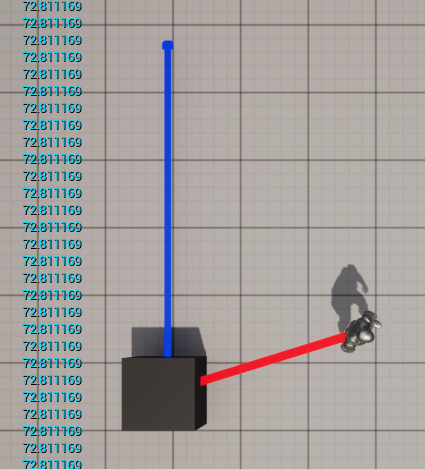
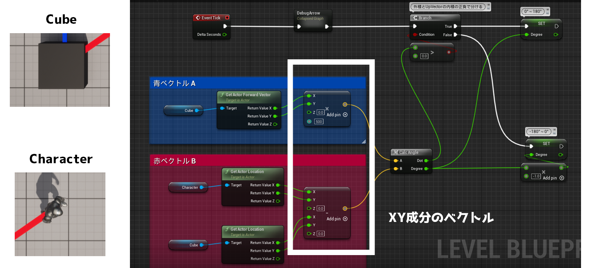
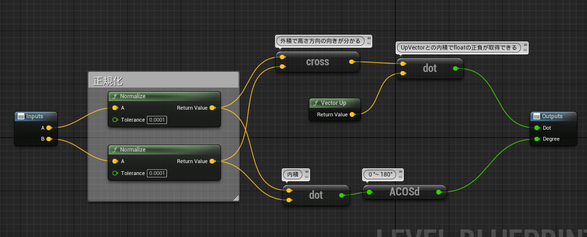

+++
draft = false
thumbnail = "2022/11/Method-to-Get-Angle-Between-Two-Vectors-in-UnrealEngine/thumbnail.png"
tags = ["UE5"]
categories = ""
date = "2022-11-19T23:37:42+09:00"
title = "2つのベクトル間の角度を取得する方法"
description = "2つのベクトル間の角度を取得する方法"
toc = true
archives = ["2022/11"]
+++

## はじめに
下記のように2つのベクトルがあった時に、そのベクトルの成す角度をUEで求めたので備忘録がてら残しておく。 
基本的には、UEでは内積で得られた値をアークコサインに入れて上げることで0°~180°を取得することが可能だが、-180°とか360°は取得できない（と思う） 
そこで、外積を用いて高さ方向の正負によって足したりマイナスかけて上げることで、0° ~ 360°とか-180° ~ 180°というような範囲で取得可能になる。 

この記事ではとりあえず、-180° ~ 180°の間を取得する方法を紹介する。 

また、作成するにあたって、下記のサイトや動画も参考にさせていただきました。 
併せてご覧頂くともっと理解が捗るのでおすすめ。 

[NG録様] https://ngroku.com/?p=4471  
[九理江めいく様] https://www.youtube.com/watch?v=IBO_V48dYW4　  
[historia様] https://historia.co.jp/archives/1820/　  

## 組んだノード
今回は、「CubeのForwardVectorベクトル」と「Cubeからキャラクターのベクトル」の成す角度を求めていく。 
また、XY平面で考えていくので、XY成分のみ抽出する。 
XY成分だけを含んだ２つのベクトルを、自作したCalcAngle関数に突っ込んで、角度を算出している。 

　 

CalcAngle関数の中身は下記 
　 
入力された2つのベクトルを、それぞれ内積(dot)と外積(cross)に通している。 
下の内積の方は基本的に-1 ~ 1で値が取得できる。やっていることは、ざっくりいうとベクトルが一緒の方向に向いているほど1に近づき 
反対向きになればなるほど-1に近づく。 
この正負な値をアークコサインに入力することで角度を取得することができる。 
ただ、このままでは0° ~ 180°までしか取得できない。例えば下記のような感じで動いてみると、180°を境に値が下がってしまうことが確認できる。 

このままでも問題ない場合はこれで良いが、360°とか-180°にしたい場合は外積を使う必要が出てくる。 
CalcAngle関数に戻り、外積の方では、その後CubeのUpVector（Z軸Vector）と外積で内積を取る。 
この内積でまた正負を判断して、マイナスなら-1を掛けてあげることで-180°を取得することが可能になる。 

## おわりに
今回は2つのベクトルのなす角度を-180° ~ 180°の範囲で取得する方法を紹介した。 
内積とか外積って習ったけどあんまり使う機会なかったので、使ってみると結構楽しいもんですね。 