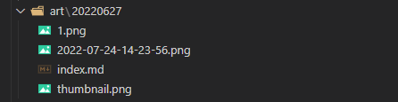
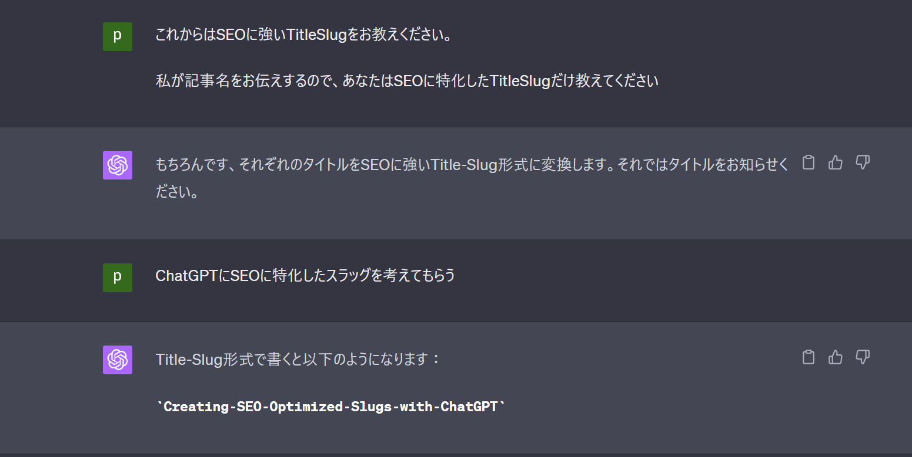

+++
draft = false
thumbnail = "2023/06/Creating-SEO-Optimized-Slugs-with-ChatGPT/thumbnail.png"
tags = ["ChatGPT","AI","SEO","Hugo"]
categories = "Blog"
date = "2023-06-12T08:15:25+09:00"
title = "ChatGPTにSEOに特化したスラッグを考えてもらう"
description = "ChatGPTにSEOに特化したスラッグを考えてもらう"
toc = true
archives = ["2023/06"]
+++

このブログはHugoで管理しているのですが、ファイル名の命名に結構困ることがあります。
というのも、大体の場合ファイル名がそのままURLに含まれることになるので、できるだけ日本語は使いたくない...。 
また、VSCodeで管理しているので、出来ればVSCodeで見たときになんとなくどういう記事なのかわかるようにもしたい...。（Year/Month/Dateみたいにすると管理はしやすいけどういう記事なのかわかりにくい） 

そもそも他の方たちはどういう風に管理しているのか気になったので確認してみたところ、大多数の方たちは記事名のキーワードをハイフン使いつつ散りばめるように命名してた。 

例えば「◯◯の解決策」であれば「errorHandling-◯◯」みたいな感じ。最終的なURLは人それぞれだけど、「ホームURL/Year/Month/Title」という感じが多かった。Titleは「errorHandling-◯◯」とか。 

どうしてかなーって軽く調べてみると、どうやらSEO対策でつけているっぽい。先程のハイフンを使った命名はスラッグと呼ばれているらしくて、これが最適化されていると検索に強くなるんだとか。意味のある単語をハイフンで並べると良いらしい。 

で、自分もそれに倣い記事名から命名しよう～って思ってやってみたんだけど結構面倒...時間もかかるし何が良さげなスラッグなのかもちょっとわからん。 
ということでタイトル通りChatGPTにお願いして記事名からSEOに特化したスラッグを教えてもらったらなんとなく良さそうだったので、困ってる方はやってみると良いかも。 

まあ本当に効果があるかどうかは分析してみないことにはわからないですが...。効果なくてもとりあえず楽なのでしばらくこれでやってみる。いずれその辺も自動化したいけど一旦はこれで。

