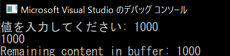

+++
draft = false
thumbnail = "2023/08/Investigating-std-cin-in-Cpp/thumbnail.png"
tags = ["C/C++"]
categories = "プログラム"
date = "2023-08-20T15:13:27+09:00"
title = "std::cinについて調査してみた"
description = "std::cinについて調査してみた"
toc = true
archives = ["2023/08"]
+++

# std::cinという入力バッファについて調査してみる

ModernC++Challengeという本を使ってC++の練習をしてます。
せっかくなので入力の正当性とかエラーハンドリングも兼ねてきれいなコードにしてみようかと思い、
cinについて今回は学んだことがあったので、それについてまとめてみた。

## std::cinには改行が残る

おおよそ一般的な使い方として、std::cinは適当な値をユーザーから入力させて適当な変数に格納…その後処理。
みたいな感じで使うはずです。

```cpp
cin >> hensu // ここで文字を入力し、エンター(\n)を押す
```

この命令なんですが、例えば10\nと入力した場合はhensuには10が格納されます。
では、残った\nは？

残ったエンターキーの入力は入力バッファ（cin?）に残り続けることになります。
なので、入力が不正だった場合に再度入力処理をさせようとすると、cinにはまだ\nが残っているので思わぬ挙動を生む原因になります。実際にはcinの再入力時の\nやスペースなどは無視されるようになっているので、基本的には問題ないとは思いますが。

細かな管理をしたいときにはこの辺の挙動も頭に入れておくと良いのかも。

試しに入力バッファを見るためのコード例を下記に示します。
適当に値を入力後、再度入力するようにしてcinに残った値を確認しています。

```cpp
		cout << "値を入力してください: ";
		cin >> limit;

		cin.ignore(numeric_limits<streamsize>::max(), '\n'); /* 改行まで無視 再度適当に値を入力*/

		string line;
		getline(cin, line);
		cout << "Remaining content in buffer: " << line << endl;
	}
```



## cin.clearとcin.ignoreに関して

この辺初めて触ったので、軽く調べてみました。

clearはcinのエラー状態フラグをリセットするものらしいです。エラーになったあとは再入力させようとしてもフラグが戻っていないので、処理がスキップされます。なので、そのためのリセット関数のようです。

ignoreの方は、上記例で示したように、入力バッファの文字を無視して捨てる関数のようです。要するに読み取られてない入力を破棄する関数です。今回は最後のエンターキーの入力まで破棄するようにしているので、入力バッファはキレイになります。

よって2つ合わせて使うことで、エラー状態を解除しつつ、入力バッファに残ったゴミを取り除くことが可能になります。

あんまりcinは入力しか使ったことがなかったので、cinに用意されている関数を見てみるといろんな関数があって勉強になります。