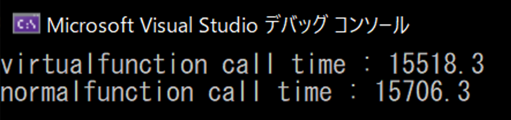

+++
draft = false
thumbnail = "2023/08/Understanding-Virtual-Functions-and-Pure-Virtual-Functions/thumbnail.png"
tags = ["C/C++"]
categories = "プログラム"
date = "2023-08-17T03:41:37+09:00"
title = "仮想関数と純粋仮想関数"
description = "仮想関数と純粋仮想関数"
toc = true
archives = ["2023/08"]
+++

## 仮想関数とは

- 派生クラス側で実装を書かせる。ただし強制はしない。
　- つまり基底クラス側に実装が存在するケース

## 純粋仮想関数とは

- 必ず派生クラス側に実装を書かせる。
　- 基底クラス側には関数名しか宣言されておらず、実装が存在しないため
- 基底クラスに実装が存在しないので、基底および派生クラスのインスタンスは作成不可能
- 純粋仮想関数のみのクラスを継承させることでインタフェースの側面も発揮する

## 仮想関数の用途

- 継承先のクラスで共通する処理を基底クラスにまとめられる。
- 継承先のクラスで別々の処理をかける（ポリモーフィズム）
　- クライアント側でクラスを意識することなく、使うことが可能。
　　- つまり基底クラスのポインタから派生クラスのオブジェクトなどを操作することができる
- コードの再利用
　- 基底クラスのコードを利用しつつ、派生先でちょっといじる。みたいなケースで使える（これが一般的？）

## 純粋仮想関数の用途

- 派生クラスに実装を強制することができる。
　- 複数人開発でメリット
　　- 書かないと実装がないのでコンパイル時にエラーになる
- 仮想関数と同様に基底クラスのポインタから派生クラスのオブジェクト操作が可能
- 純粋仮想関数だけのクラスにすればインタフェースとして使うことが可能

## デメリット
- 仮想関数を持っているクラスはほんの少しメモリ使用量も増える
- パフォーマンスが少し悪くなる

下記のように、100億回呼び出すようなコードを実行してみるとまあまあ差が出てくることがわかる。
1億ぐらいであれば誤差もしくはたまに仮想関数呼び出しのほうが早く終わるケースも出てくる。

```cpp
#include <iostream>
#include <chrono>

using namespace std;

class Base
{
public:
	virtual void virtualFunction() {}
	void normalFunction() {}
};

int main()
{
	Base base;
	const int iterations = 10000000000;

	chrono::system_clock::time_point start, end;

	/* 仮想関数呼び出し */
	start = chrono::system_clock::now();
	for(int i = 0; i < iterations; i++) {
		base.virtualFunction();
	}
	end = chrono::system_clock::now();

	double time = static_cast<double>(chrono::duration_cast<chrono::microseconds>(end - start).count() / 1000.0);

	cout <<"virtualfunction call time : " << time << endl;

	/* 関数呼び出し */
	start = chrono::system_clock::now();
	for(int i = 0; i < iterations; i++) {
		base.normalFunction();
	}
	end = chrono::system_clock::now();

	time = static_cast<double>(chrono::duration_cast<chrono::microseconds>(end - start).count() / 1000.0);

	cout << "normalfunction call time : " << time << endl;

	return 0;
}
```

