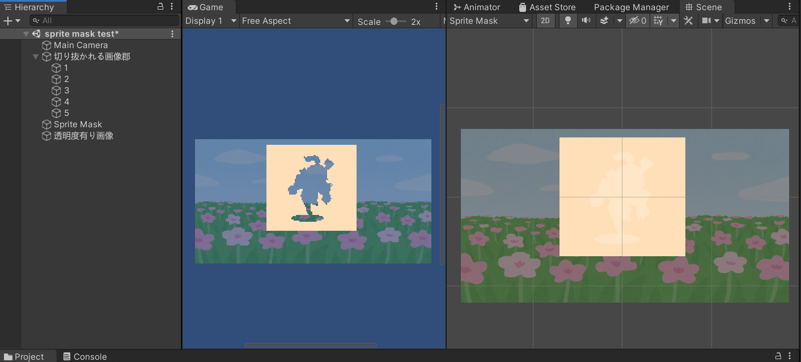

+++
draft = true
thumbnail = ""
tags = ["Unity","C-sharp"]
categories = "Program"
date = "2022-01-16T23:22:06+09:00"
title = "Unityで好きな形で画像を切り抜く方法"
description = ""
+++

# はじめに
UnityのSprite Imageであれば好きな形で画像を切り抜くことができます。
ちなみに同じ画像のuGUIとかはUnityの標準機能だと内側を切り抜くのは難しいようです。（専用のアセットが必要）

こんな感じでUnityちゃんの形に切り抜いたりできます。別の画像でやりたい場合は、お好きな透明度付きのpngを用意してください。

 

# uGUIとSprite Imageについて

