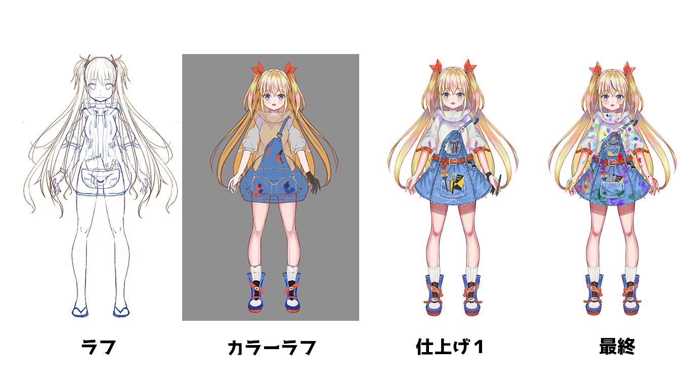

+++
draft = true
thumbnail = "art/20220627/thumbnail.png"
tags = ["LIVE2D"]
categories = "Art"
date = "2022-06-27T03:41:34+09:00"
title = "初めてのLive2Dでオリジナルキャラを動かしてみた"
description = "初めてオリジナルキャラクターを作成してLIVE2Dを使ってVtuberを作ってみた"
toc = true
archives = ["2022/6"]
+++
##  はじめに
実は1年ぐらい前にはなるが、LIVE2Dを勉強する目的も兼ねて、自分で素材を描いてLIVE2Dで動かしてました。
せっかくなのでやったこととか学んだこととかをまとめておこうかなと思います。

ちなみに、初めてのLIVE2Dでものすごくお世話になった参考書があるので、紹介しておきます。
特典のダウンロード動画がすごく使いやすくて最後まで走り切ることが出来ました。感謝。
<iframe sandbox="allow-popups allow-scripts allow-modals allow-forms allow-same-origin" style="width:120px;height:240px;" marginwidth="0" marginheight="0" scrolling="no" frameborder="0" src="//rcm-fe.amazon-adsystem.com/e/cm?lt1=_blank&bc1=000000&IS2=1&bg1=FFFFFF&fc1=000000&lc1=0000FF&t=ixa193-22&language=ja_JP&o=9&p=8&l=as4&m=amazon&f=ifr&ref=as_ss_li_til&asins=B091CJCLD3&linkId=3cf50f305a4fce6ac0943cf91dcf84bf"></iframe>

## 完成したモデル
最終的にこんな感じで作成することができました。これ完成したの去年の1月とかだったので、今見るとだいぶ変なところは多いですが、最初のモデルとしては結構良いものに仕上がったのと思っています。動きについてはLIVE2Dで用意されているランダムポーズにマウスで追従させただけのものになります。

## ラフから仕上げまで
自分のオリジナルキャラクターを作るにあたって欲しい要素を出してそのまま取り入れてみました。 
- 金髪ツインテール
- 少し足を覆うぐらいのスニーカー、ブーツ的な感じのもの
- イラスト制作してるのがわかるような、鉛筆とかブラシの小道具
- 首を覆うパーカー

以上を念頭に、ラフをこねて色をおいた感じ、黄赤青というおもちゃカラーに...ｗ 
けど結構良い感じに思えてきたので、小道具を追加して、最後に少し汚れを追加してイラストレーターっぽいVtuberにしてみました。 

本当はペンタブとか手袋も装着したままにしたかったのですが、気づいたらどこかに消えていた・・・ 
バージョンアップするときに戻せたら戻そうかと思います。 

 

## パーツ分け

# todo
- [x] サムネイル編集　および　テンプレ作成
- [ ] 内容作成
- [x] デモ動画を載せられるようにYoutubeかTwitterのリンク用意

  